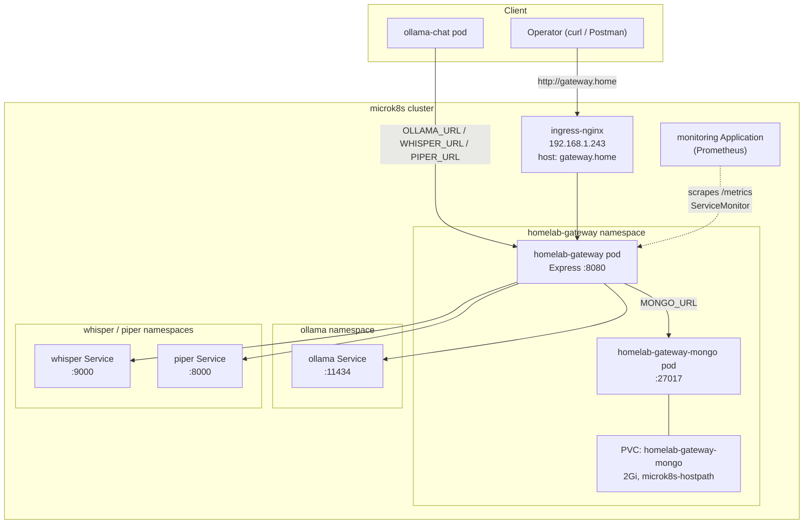

# Architecture

`homelab-gateway` is a single Express process: a content-sniffing reverse proxy in front of
Ollama/Whisper/Piper, plus two side effects on every proxied call — a Prometheus metric and a
MongoDB log entry. There's no routing table, no per-client config, and no state beyond that
log — see [`docs/adr/`](./adr/README.md) for the non-obvious decisions behind it (why a bundled
MongoDB instead of just the metrics; why Ollama's native timing stats are extracted into
structured fields on top of that).

This page is the map: components and the production runtime topology. See also:

- [`routing.md`](./routing.md) — how a backend is picked by content, and what happens during a proxied call (Origin rewrite, fire-and-forget logging)
- [`deployment.md`](./deployment.md) — CI/CD pipeline

## Components

| Component | Role | Source |
|---|---|---|
| Express app | Content-sniffing router + reverse proxy | `server/index.js` |
| `homelab-gateway-mongo` | Bundled MongoDB, per-call request/response log + structured Ollama timing stats | `server/call-log.js`, `k8s/mongo.yaml`, [ADR-0001](./adr/0001-mongodb-call-log.md), [ADR-0002](./adr/0002-structured-ollama-stats.md) |
| `/metrics` | Prometheus counters/histograms, scraped by `gitops-homelab`'s monitoring stack | `server/index.js` (`prom-client`) |
| Ollama | LLM inference backend | in-cluster `ollama` Service |
| Whisper | Speech-to-text backend | in-cluster `whisper` Service |
| Piper | Text-to-speech backend | in-cluster `piper` Service |
| ArgoCD + GHCR | Builds, publishes, and deploys this app on every push to `main` | `.github/workflows/docker-publish.yml`, `k8s/` |

This repo owns none of Ollama/Whisper/Piper themselves, nor the cluster/ArgoCD/MetalLB layer
those Services sit on — see
[`gitops-homelab`'s architecture.md](https://github.com/koydas/gitops-homelab/blob/main/docs/architecture.md)
for that. `ollama-chat` is the one real production client of this gateway today — see
[its architecture.md](https://github.com/koydas/ollama-chat/blob/main/docs/architecture.md)
for how it's called from that side.

## Runtime topology

Reached only through `ingress-nginx` at `gateway.home` — no dedicated MetalLB IP of its own
(the README's Deployment section covers why: the pool was nearly out of free addresses by the
time this app was onboarded). `homelab-gateway-mongo` is `ClusterIP`-only, reachable from
nowhere outside this namespace. For the cluster-wide picture (ArgoCD, MetalLB pool, other
namespaces, monitoring stack setup) see
[`gitops-homelab`'s architecture.md](https://github.com/koydas/gitops-homelab/blob/main/docs/architecture.md)
and [ADR-0020](https://github.com/koydas/gitops-homelab/blob/main/docs/adr/0020-onboard-homelab-gateway.md)
(this app's onboarding decision, recorded in that repo since it's about *where this app lives
in the cluster*, not about this repo's own code).
