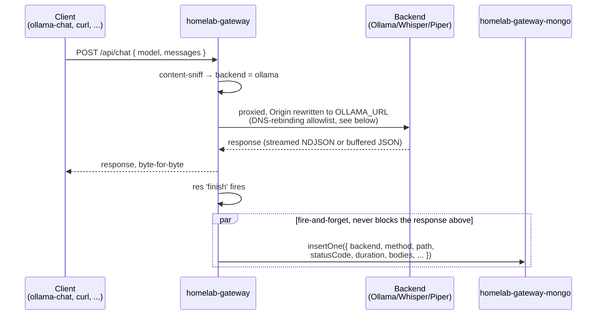
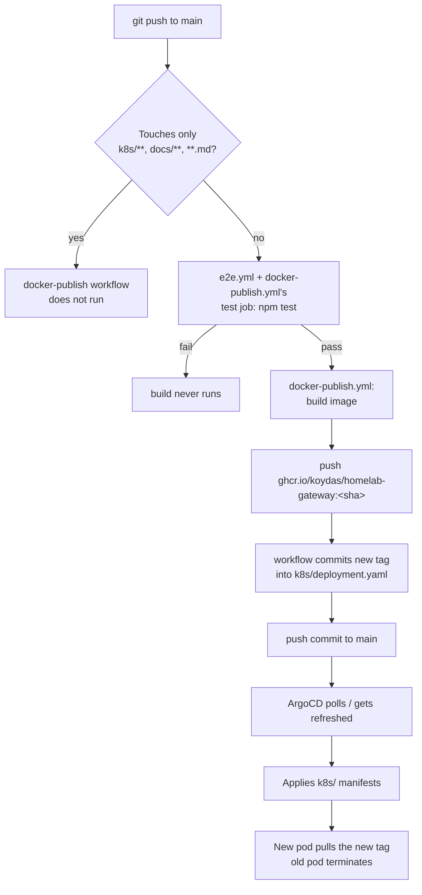
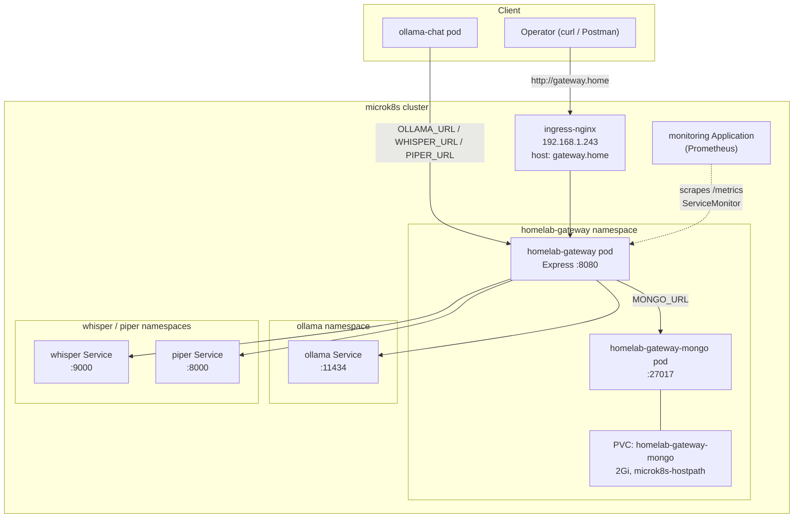

# Architecture

`homelab-gateway` is a single Express process: a content-sniffing reverse proxy in front of
Ollama/Whisper/Piper, plus two side effects on every proxied call — a Prometheus metric and a
MongoDB log entry. There's no routing table, no per-client config, and no state beyond that
log — see [`docs/adr/`](./adr/README.md) for the one non-obvious decision (why a bundled
MongoDB instead of just the metrics).

## Components

| Component | Role | Source |
|---|---|---|
| Express app | Content-sniffing router + reverse proxy | `server/index.js` |
| `homelab-gateway-mongo` | Bundled MongoDB, per-call request/response log | `server/call-log.js`, `k8s/mongo.yaml`, [ADR-0001](./adr/0001-mongodb-call-log.md) |
| `/metrics` | Prometheus counters/histogram, scraped by `gitops-homelab`'s monitoring stack | `server/index.js` (`prom-client`) |
| Ollama | LLM inference backend | in-cluster `ollama` Service |
| Whisper | Speech-to-text backend | in-cluster `whisper` Service |
| Piper | Text-to-speech backend | in-cluster `piper` Service |
| ArgoCD + GHCR | Builds, publishes, and deploys this app on every push to `main` | `.github/workflows/docker-publish.yml`, `k8s/` |

This repo owns none of Ollama/Whisper/Piper themselves, nor the cluster/ArgoCD/MetalLB layer
those Services sit on — see
[`gitops-homelab`'s architecture.md](https://github.com/koydas/gitops-homelab/blob/main/docs/architecture.md)
for that. `ollama-chat` is the one real production client of this gateway today — see
[its architecture.md](https://github.com/koydas/ollama-chat/blob/main/docs/architecture.md)
for how it's called from that side.

## Routing: picking a backend by content, not by path

There's no `/ollama/*`, `/whisper/*`, `/piper/*` URL scheme — every request arrives at
whatever path the client used (`/api/chat`, `/api/tags`, ...) and the gateway decides where it
goes purely from `Content-Type` and the JSON body shape:

```mermaid
flowchart TD
    A[Incoming request] --> B{Content-Type is<br/>audio/* or multipart/form-data?}
    B -- yes --> W["Whisper<br/>POST /asr (streamed, unparsed)"]
    B -- no --> C[express.json parses body]
    C --> D{JSON body has a<br/>'text' field, no 'model'?}
    D -- yes --> P["Piper<br/>POST /tts"]
    D -- no --> E{JSON body has<br/>a 'model' field?}
    E -- yes --> O["Ollama<br/>original path preserved"]
    E -- no --> F{Body is empty<br/>(GET, /api/tags, ...)?}
    F -- yes --> O
    F -- no --> R["400: can't determine backend"]
```

This is a deliberate trade-off: it means one entry point works for chat, STT, and TTS with
zero path convention for clients to remember, but a bodiless request has nothing to sniff, so
rule 4's "default to Ollama" is a real design choice, not a fallback-of-convenience — see the
README's Routing rules section for the exact precedence, and `server/index.js` for the
implementation (order of `app.use()` calls *is* the precedence).

## Request flow: a proxied call



Two details worth calling out:

- **Origin rewrite (Ollama only)** — Ollama enforces an Origin allowlist (DNS-rebinding
  protection) and rejects anything that isn't same-origin with itself.
  `changeOrigin: true` (from `http-proxy-middleware`) only rewrites the `Host` header, not
  `Origin`, so without an explicit `proxyReq.setHeader('origin', OLLAMA_URL)` the client's own
  Origin would pass through untouched and get a 403 — this exact bug was hit and fixed while
  wiring `ollama-chat` through this gateway (see that repo's ADR-0014). Whisper/Piper don't
  need this; only Ollama checks Origin.
- **Logging never blocks the response** — the Mongo insert in the diagram above happens
  *after* the response has already been sent to the client, off the `res.on('finish')` event.
  A slow or unreachable Mongo adds zero latency to a proxied call and can never turn a working
  backend into a failing request — see [ADR-0001](./adr/0001-mongodb-call-log.md) for the full
  reasoning (also covers what gets captured vs. dropped: size limits, content-type filtering,
  binary bodies).

## Deployment pipeline



Same shape as `ollama-chat`'s pipeline (see that repo's architecture.md for the general
mechanics — `paths-ignore`, why the tag-rewrite commit doesn't re-trigger itself). One gotcha
specific to this repo's operating history: ArgoCD's poll-sync can grab the *code-push* commit
before the *tag-rewrite* commit lands, briefly running new config against an old image — see
`gitops-homelab`'s runbook.md for the incident writeup and the hard-refresh fix. `npm test`
(the real e2e suite, `test/gateway.e2e.test.js`) now gates the build entirely — see the
README's Tests section and [ADR-0001](./adr/0001-mongodb-call-log.md) for what it covers and
why it exists.

## Runtime topology



Reached only through `ingress-nginx` at `gateway.home` — no dedicated MetalLB IP of its own
(the README's Deployment section covers why: the pool was nearly out of free addresses by the
time this app was onboarded). `homelab-gateway-mongo` is `ClusterIP`-only, reachable from
nowhere outside this namespace. For the cluster-wide picture (ArgoCD, MetalLB pool, other
namespaces, monitoring stack setup) see
[`gitops-homelab`'s architecture.md](https://github.com/koydas/gitops-homelab/blob/main/docs/architecture.md)
and [ADR-0020](https://github.com/koydas/gitops-homelab/blob/main/docs/adr/0020-onboard-homelab-gateway.md)
(this app's onboarding decision, recorded in that repo since it's about *where this app lives
in the cluster*, not about this repo's own code).
