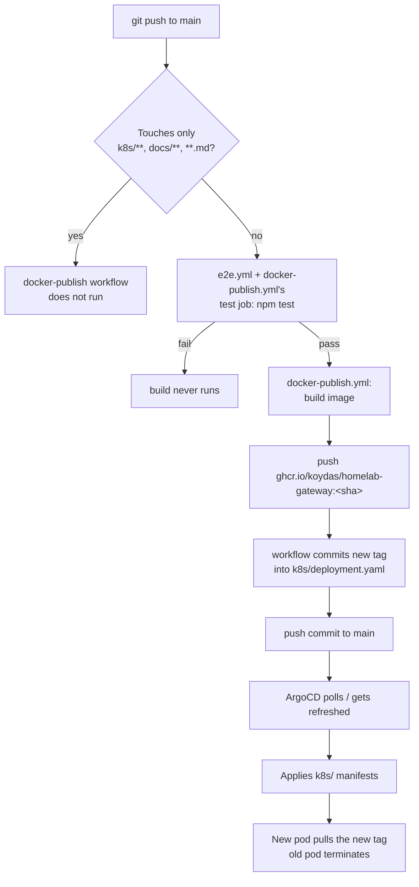

# Deployment pipeline

Same shape as `ollama-chat`'s pipeline (see that repo's `docs/deployment.md` for the general
mechanics — `paths-ignore`, why the tag-rewrite commit doesn't re-trigger itself). One gotcha
specific to this repo's operating history: ArgoCD's poll-sync can grab the *code-push* commit
before the *tag-rewrite* commit lands, briefly running new config against an old image — see
`gitops-homelab`'s runbook.md for the incident writeup and the hard-refresh fix. `npm test`
(the real e2e suite, `test/gateway.e2e.test.js`) now gates the build entirely — see the
README's Tests section and [ADR-0001](./adr/0001-mongodb-call-log.md) for what it covers and
why it exists.
