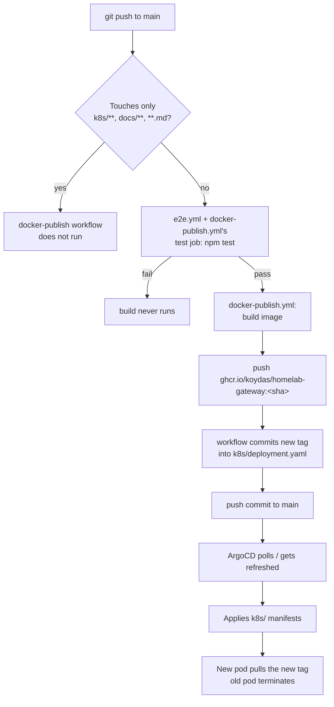

# Deployment pipeline



Same shape as `ollama-chat`'s pipeline (see that repo's `docs/deployment.md` for the general
mechanics — `paths-ignore`, why the tag-rewrite commit doesn't re-trigger itself). One gotcha
specific to this repo's operating history: ArgoCD's poll-sync can grab the *code-push* commit
before the *tag-rewrite* commit lands, briefly running new config against an old image — see
`gitops-homelab`'s runbook.md for the incident writeup and the hard-refresh fix. `npm test`
(the real e2e suite, `test/gateway.e2e.test.js`) now gates the build entirely — see the
README's Tests section and [ADR-0001](./adr/0001-mongodb-call-log.md) for what it covers and
why it exists.

## Setting up the Anthropic API key

`k8s/deployment.yaml` mounts `ANTHROPIC_API_KEY` from a Secret (`homelab-gateway-anthropic`)
that is **created out-of-band, once, directly in the cluster** — never committed to Git
([ADR-0004](./adr/0004-gateway-owns-anthropic-key.md)). Without it, any request whose `model`
starts with `claude-` gets an immediate `500` (checked before the request is proxied anywhere)
— every other backend (Ollama/Whisper/Piper) is unaffected.

Generate the key at [console.anthropic.com](https://console.anthropic.com), then create the
Secret yourself, in your own terminal — not pasted through an AI chat session, since it's a
standing credential:

```sh
read -s -p "Paste the Anthropic API key: " ANTHROPIC_KEY && echo
sudo microk8s kubectl create secret generic homelab-gateway-anthropic \
  -n homelab-gateway \
  --from-literal=ANTHROPIC_API_KEY="$ANTHROPIC_KEY" \
  --dry-run=client -o yaml | sudo microk8s kubectl apply -f -
unset ANTHROPIC_KEY
```

(`read -s` keeps it out of shell history.) Verify it landed without printing the value:

```sh
sudo microk8s kubectl get secret homelab-gateway-anthropic -n homelab-gateway
```
