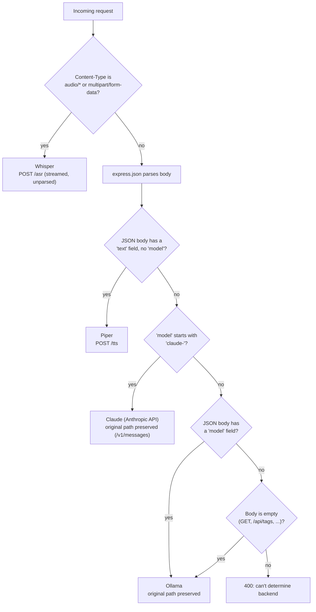
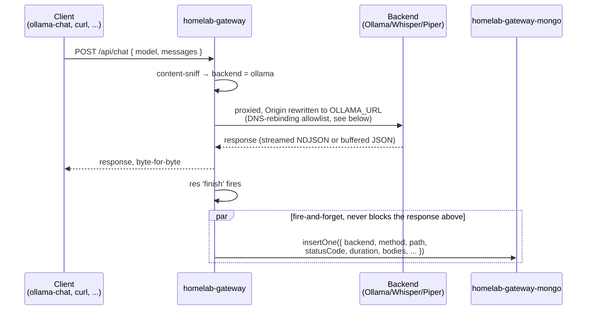

# Routing and request flow

## Routing: picking a backend by content, not by path

There's no `/ollama/*`, `/whisper/*`, `/piper/*`, `/claude/*` URL scheme — every request
arrives at whatever path the client used (`/api/chat`, `/v1/messages`, ...) and the gateway
decides where it goes purely from `Content-Type` and the JSON body shape:

This is a deliberate trade-off: it means one entry point works for chat, STT, and TTS with
zero path convention for clients to remember, but a bodiless request has nothing to sniff, so
rule 4's "default to Ollama" is a real design choice, not a fallback-of-convenience — see the
README's Routing rules section for the exact precedence, and `server/index.js` for the
implementation (order of `app.use()` calls *is* the precedence).

## Request flow: a proxied call

Two details worth calling out:

- **Origin rewrite (Ollama only)** — Ollama enforces an Origin allowlist (DNS-rebinding
  protection) and rejects anything that isn't same-origin with itself.
  `changeOrigin: true` (from `http-proxy-middleware`) only rewrites the `Host` header, not
  `Origin`, so without an explicit `proxyReq.setHeader('origin', OLLAMA_URL)` the client's own
  Origin would pass through untouched and get a 403 — this exact bug was hit and fixed while
  wiring `ollama-chat` through this gateway (see that repo's ADR-0014). Whisper/Piper don't
  need this; only Ollama checks Origin.
- **Logging never blocks the response** — the Mongo insert in the diagram above happens
  *after* the response has already been sent to the client, off the `res.on('finish')` event.
  A slow or unreachable Mongo adds zero latency to a proxied call and can never turn a working
  backend into a failing request — see [ADR-0001](./adr/0001-mongodb-call-log.md) for the full
  reasoning (also covers what gets captured vs. dropped: size limits, content-type filtering,
  binary bodies).
